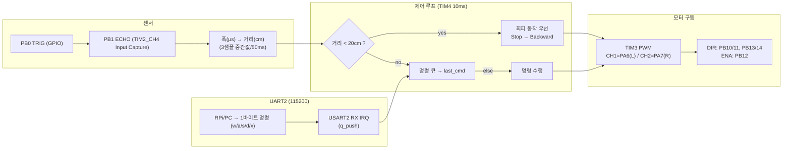
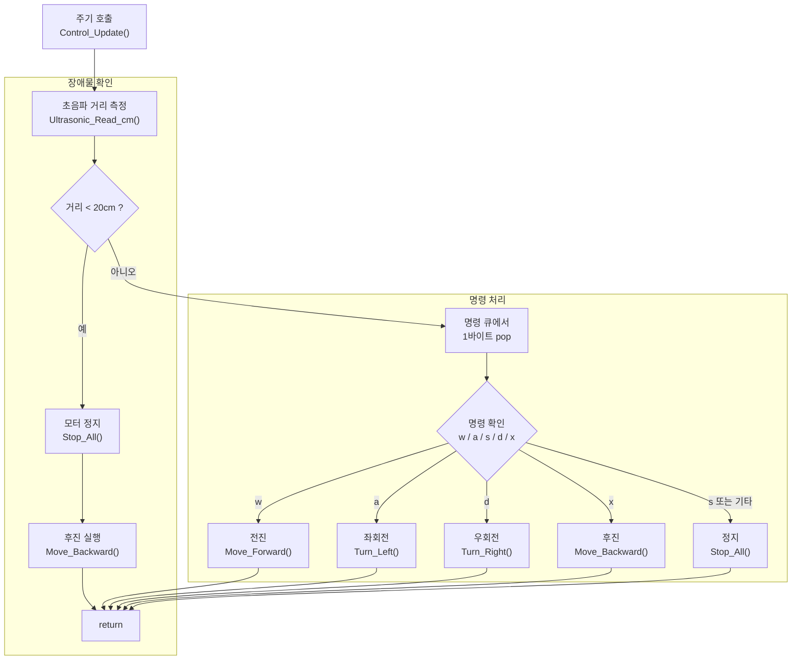
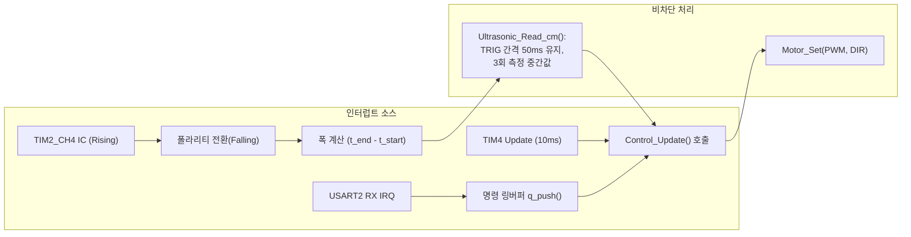
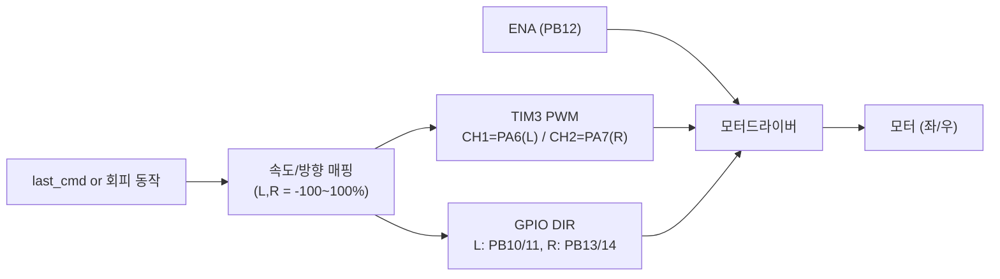
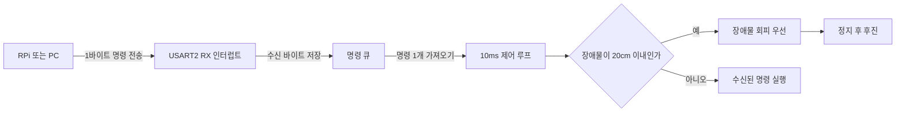

# STM32 (NUCLEO-F103RB) — 안전 우선 로봇 제어 펌웨어

> **요약**: 초음파(회피) + PWM 모터 + UART 명령.  
> 근처에 장애물이 있다면, **항상 장애물 회피가 우선**, 평소엔 Vision에 따라 **한 글자 명령(w/a/s/d/x)**을 따른다.


---

## 1) TL;DR 
- **우선순위 제어**: 장애물 회피 > 수신 명령 (Fail-safe)
- **비차단 루프**: 10ms `Control_Update()` + IRQ(UART/TIM/IC)
- **간결한 프로토콜**: UART 1바이트 `w/a/s/d/x` (지연·충돌 강인)
- **안정화**: 초음파 3샘플 중간값, PWM 15~20kHz로 구동음 저감

---

## 2) 핀 & 타이머
- **UART2**: PA2/PA3 (115200-8N1)  
- **PWM (TIM3)**: CH1=PA6(좌), CH2=PA7(우)  
- **DIR**: PB10/PB11(좌 전/후), PB13/PB14(우 전/후), **ENA**=PB12(선택)  
- **초음파**: TRIG=PB0(GPIO), ECHO=PB1(**TIM2_CH4 입력캡처, 1MHz**)  
- **제어틱**: **TIM4 10ms** (업데이트 인터럽트)

---

## 3) Flow Chart
```text
[IC: TIM2] Echo 펄스폭(us) ──► 거리(cm)
[UART] 1B RX ───────────────► 명령 큐(w/a/s/d/x)
[TIM4] 10ms ────────────────► Control_Update():
                                if 거리<임계(20cm) → 회피(return)
                                else → 최근 명령 수행
```
---

## 4) 핵심 코드 정리
### 4.1 우선순위 제어(10ms 루프)
```text
void Control_Update(void){
  uint16_t d = Ultrasonic_Read_cm();   // 3샘플 중간값, 내부 50ms 간격
  if (d > 0 && d < 20){                // 안전 먼저
    Stop_All(); Move_Backward(); return;
  }
  switch(last_cmd){                    // UART 1바이트 명령
    case 'w': Move_Forward();  break;
    case 'a': Turn_Left();     break;
    case 'd': Turn_Right();    break;
    case 'x': Move_Backward(); break;
    default : Stop_All();      break;
  }
}
```

### 4.2 초음파 입력캡처(ECHO<->TRIG)
```text
void HAL_TIM_IC_CaptureCallback(TIM_HandleTypeDef *htim){

if(htim->Channel == HAL_TIM_ACTIVE_CHANNEL_4){       // TIM2_CH4 예시

  static uint32_t t_start; static uint8_t cap=0;     // 1MHz=1us

  if(!cap){
      t_start = HAL_TIM_ReadCapturedValue(htim, TIM_CHANNEL_4);
      cap = 1;
      __HAL_TIM_SET_CAPTUREPOLARITY(htim, TIM_CHANNEL_4, TIM_INPUTCHANNELPOLARITY_FALLING);
    }
  else{
      uint32_t t_end = HAL_TIM_ReadCapturedValue(htim, TIM_CHANNEL_4);
      echo_width_us = (t_end>=t_start) ? (t_end-t_start) : (t_end + (0xFFFF - t_start) + 1);
      cap = 0;
      __HAL_TIM_SET_CAPTUREPOLARITY(htim, TIM_CHANNEL_4, TIM_INPUTCHANNELPOLARITY_RISING);
    }
  }
}
```

### 4.3 UART 1바이트 수신(명령어 하나 수신)
```text
void HAL_UART_RxCpltCallback(UART_HandleTypeDef *huart){
  static uint8_t c;
  if(huart->Instance == USART2){
    q_push(c);                           // 링버퍼에 1바이트 적재
    HAL_UART_Receive_IT(&huart2, &c, 1); // 다음 1바이트 예약
  }
}
```

---
## 5) Flow Chart
### 5.1 보드 내부 데이터


### 5.2 우선순위 제어 로직


### 5.3 인터럽트/타이머 관계도


### 5.4 모터 구동 경로(신호 → 드라이버)


### 5.5 UART 1바이트 명령 처리(간결 프로토콜)

---
  


